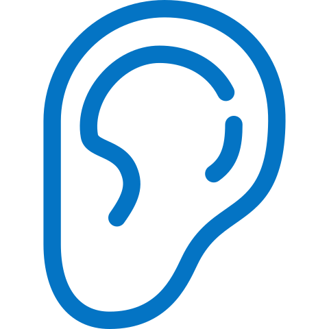

  
<h1> The #MeToo movement : a story telling through data </h1>



 

  
  The aim of this project is to use a dataset of tweets containing #metoo and associated hashtags, in order to analyze this movement and better understand it.
  
    
  
  The #MeToo movement is a global movement against sexual abuse. It spread virally in October 2017 as a hashtag used on social media in order to show the widespread phenomenon of sexual harassment, particularly in the workplace. The idea is to fearlessly talk about any sexual abuse one might experience and to rebel against the culture of staying silent after going through such traumatising experiences. A lot of celebrities participated in this movement by highlighting their stories on social media, including renowned actress, personalities, and politics, but also persons from simple backgrounds. As a team we are motivated to understand the movement because of its intensity and controverse. It is a challenge to put aside our personal opinion as individuals and consider only the data around this thematic to arrive to an interesting yet objective datastory.
  
    
  

  
 
  

  
<h1> Explore the movement timeline </h1>

Please select a hashtag to visualize the associated activity on Twitter.



  

<h1> Tweeting is sharing </h1>
  
  

   An important thing to notice is that - as in a lot of movements on Twitter - most of these tweets are actually retweets. Indeed, it is the case for almost 3 tweets over 4. Thus, in any cases, we cannot talk about isolated testimonies. It shows that this mobilization is over all a process of sharing stories of others by showing support or disagreement. Twitter hence enables the connection of persons worldwide to develop a base and gain awareness to the cause. This can be also criticized : it raises the question of stacktivism, which happens when people show support for a cause with the main purpose of boosting the egos of participants in the movement, by simple actions ("like", "retweet"...) that require very little thought or effort. 
  

  

Here are the tweets in our dataset that has been the most retweeted.

  

<blockquote class="twitter-tweet" data-lang="fr">
The 16 women who accused Trump of sexual assault are telling their story in one video-please share this far &amp; wide. RT if you agree it’s time for Trump to be held accountable for his sexual misconduct.<a href="https://twitter.com/hashtag/TrumpSexPredator?src=hash&amp;ref_src=twsrc%5Etfw">#TrumpSexPredator</a> <a href="https://twitter.com/hashtag/AMJoy?src=hash&amp;ref_src=twsrc%5Etfw">#AMJoy</a><a href="https://t.co/hNIqZEI54G">pic.twitter.com/hNIqZEI54G</a>
&mdash; Scott Dworkin (@funder) <a href="https://twitter.com/funder/status/932703161596432384?ref_src=twsrc%5Etfw">20 novembre 2017</a></blockquote>

  

<blockquote class="twitter-tweet" data-lang="fr">
I mean, what world are we living in that an accused sexual abuser is allowed to be our President and an accused pedophile is allowed to run for senate? These two things have many things in common - one of which - is the Republican National Committee. <a href="https://twitter.com/hashtag/MeToo?src=hash&amp;ref_src=twsrc%5Etfw">#MeToo</a>
&mdash; Alyssa Milano (@Alyssa_Milano) <a href="https://twitter.com/Alyssa_Milano/status/938186096080506882?ref_src=twsrc%5Etfw">5 décembre 2017</a></blockquote>

  

 <blockquote class="twitter-tweet" data-lang="fr">
Just reported <a href="https://twitter.com/Rosie?ref_src=twsrc%5Etfw">@Rosie</a> for targeted harassment, mainly to see if Twitter does indeed have a double standard. Everyone knows if Rosie were conservative, Twitter would suspend her in a hot second. So, Twitter, put your money where your mouth is. <a href="https://twitter.com/hashtag/MeToo?src=hash&amp;ref_src=twsrc%5Etfw">#MeToo</a>
&mdash; Ben Shapiro (@benshapiro) <a href="https://twitter.com/benshapiro/status/944220986525618176?ref_src=twsrc%5Etfw">22 décembre 2017</a></blockquote>

  

<blockquote class="twitter-tweet" data-lang="fr">
I talked to a girl who says she went on a date with <a href="https://twitter.com/azizansari?ref_src=twsrc%5Etfw">@azizansari</a> in an exclusive for <a href="https://twitter.com/babedotnet?ref_src=twsrc%5Etfw">@babedotnet</a>. She told me, &quot;It was by far the worst experience with a man I’ve ever had.&quot; I believe her. <a href="https://twitter.com/hashtag/TimesUp?src=hash&amp;ref_src=twsrc%5Etfw">#TimesUp</a> <a href="https://twitter.com/hashtag/MeToo?src=hash&amp;ref_src=twsrc%5Etfw">#MeToo</a> <a href="https://twitter.com/hashtag/AzizAnsari?src=hash&amp;ref_src=twsrc%5Etfw">#AzizAnsari</a> <a href="https://t.co/p7q0fjSsh0">https://t.co/p7q0fjSsh0</a>
&mdash; Katie Way (@k80way) <a href="https://twitter.com/k80way/status/952327321431756801?ref_src=twsrc%5Etfw">13 janvier 2018</a></blockquote>

 

<h1> Topic clustering </h1>

 



 

<h1> Sentimental Analysis on All Tweets </h1>

<h1> Context Analysis All Tweets </h1>

 

 &nbsp;  &nbsp;     &nbsp;  &nbsp; 

 



 

<h1> Thematics Analysis All Tweets </h1>
 

 &nbsp;  &nbsp;  &nbsp;  &nbsp;  &nbsp;  &nbsp; 

 



 

<h1> Implication, Group Dynamics and Certitude Analysis All Tweets </h1>

 

 &nbsp;  &nbsp;  &nbsp; &nbsp;  &nbsp; 

 



 



 

<h1> Positive or Negative Emotional Analysis All Tweets </h1>
 

 &nbsp;  &nbsp;  &nbsp;  &nbsp;  &nbsp;  &nbsp;  &nbsp;  &nbsp; 

 



 

<h1> Sentimental Analysis for Gender </h1>
 



 

<h1> Sentimental Analysis over Time </h1>

<h1> Context & Thematics </h1>
 



 

<h1> Emotions & Implications </h1>
 



 

