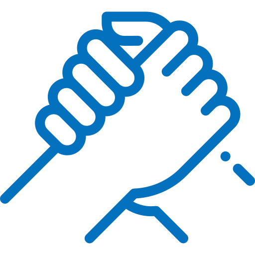
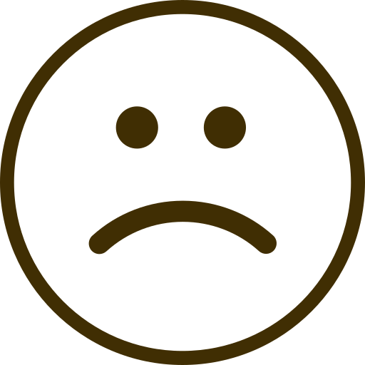
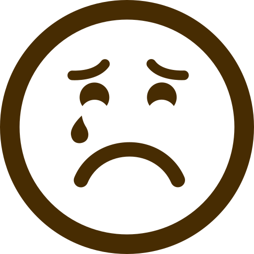

  
<h1> The #MeToo movement :</h1>
<h3> A Temporal, Gender Based and Sentimental Perspective </h3>



 

  
  The aim of this project is to use a dataset of tweets containing #metoo and associated hashtags, in order to analyze this movement and better understand it.
  
    
  
  The #MeToo movement is a global movement against sexual abuse. It spread virally in October 2017 as a hashtag used on social media in order to show the widespread phenomenon of sexual harassment, particularly in the workplace. The idea is to fearlessly talk about any sexual abuse one might experience and to rebel against the culture of staying silent after going through such traumatising experiences. A lot of celebrities participated in this movement by highlighting their stories on social media, including renowned actress, personalities, and politics, but also people from simple backgrounds. As a team we are motivated to understand the movement because of its intensity and controverse. It is a challenge to put aside our personal opinion as individuals and consider only the data around this thematic to arrive to an interesting yet objective datastory.
  
    
  

  
 
  

  
<h1> Explore the movement timeline </h1>

Please select a hashtag to visualize the associated activity on Twitter.



  

<h1> Tweeting is sharing </h1>
  
  

   An important thing to notice is that - as in a lot of movements on Twitter - most of these tweets are actually retweets. Indeed, it is the case for almost 3 tweets out of 4. Thus, in any case, we cannot talk about isolated testimonies. It shows that this mobilization is overall a process of sharing stories of others by showing support or disagreement. Twitter hence enables the connection of people worldwide to develop a common battle and gain awareness for the cause. This group phenomenom can be also criticized : it raises the question of stacktivism, which happens when people show support for a cause with the main purpose of boosting the egos of participants in the movement, by simple actions ("like", "retweet"...) that require very little thought or effort. 
  

  

Here are the tweets in our dataset that have been the most retweeted.

  

<blockquote class="twitter-tweet" data-lang="fr">
The 16 women who accused Trump of sexual assault are telling their story in one video-please share this far &amp; wide. RT if you agree it’s time for Trump to be held accountable for his sexual misconduct.<a href="https://twitter.com/hashtag/TrumpSexPredator?src=hash&amp;ref_src=twsrc%5Etfw">#TrumpSexPredator</a> <a href="https://twitter.com/hashtag/AMJoy?src=hash&amp;ref_src=twsrc%5Etfw">#AMJoy</a><a href="https://t.co/hNIqZEI54G">pic.twitter.com/hNIqZEI54G</a>
&mdash; Scott Dworkin (@funder) <a href="https://twitter.com/funder/status/932703161596432384?ref_src=twsrc%5Etfw">20 novembre 2017</a></blockquote>

  

<blockquote class="twitter-tweet" data-lang="fr">
I mean, what world are we living in that an accused sexual abuser is allowed to be our President and an accused pedophile is allowed to run for senate? These two things have many things in common - one of which - is the Republican National Committee. <a href="https://twitter.com/hashtag/MeToo?src=hash&amp;ref_src=twsrc%5Etfw">#MeToo</a>
&mdash; Alyssa Milano (@Alyssa_Milano) <a href="https://twitter.com/Alyssa_Milano/status/938186096080506882?ref_src=twsrc%5Etfw">5 décembre 2017</a></blockquote>

  

 <blockquote class="twitter-tweet" data-lang="fr">
Just reported <a href="https://twitter.com/Rosie?ref_src=twsrc%5Etfw">@Rosie</a> for targeted harassment, mainly to see if Twitter does indeed have a double standard. Everyone knows if Rosie were conservative, Twitter would suspend her in a hot second. So, Twitter, put your money where your mouth is. <a href="https://twitter.com/hashtag/MeToo?src=hash&amp;ref_src=twsrc%5Etfw">#MeToo</a>
&mdash; Ben Shapiro (@benshapiro) <a href="https://twitter.com/benshapiro/status/944220986525618176?ref_src=twsrc%5Etfw">22 décembre 2017</a></blockquote>

  

<blockquote class="twitter-tweet" data-lang="fr">
I talked to a girl who says she went on a date with <a href="https://twitter.com/azizansari?ref_src=twsrc%5Etfw">@azizansari</a> in an exclusive for <a href="https://twitter.com/babedotnet?ref_src=twsrc%5Etfw">@babedotnet</a>. She told me, &quot;It was by far the worst experience with a man I’ve ever had.&quot; I believe her. <a href="https://twitter.com/hashtag/TimesUp?src=hash&amp;ref_src=twsrc%5Etfw">#TimesUp</a> <a href="https://twitter.com/hashtag/MeToo?src=hash&amp;ref_src=twsrc%5Etfw">#MeToo</a> <a href="https://twitter.com/hashtag/AzizAnsari?src=hash&amp;ref_src=twsrc%5Etfw">#AzizAnsari</a> <a href="https://t.co/p7q0fjSsh0">https://t.co/p7q0fjSsh0</a>
&mdash; Katie Way (@k80way) <a href="https://twitter.com/k80way/status/952327321431756801?ref_src=twsrc%5Etfw">13 janvier 2018</a></blockquote>

 

<h1> Topic clustering </h1>

In this interactive figure, you can visualize the main topics discussed among the movement. Click on "next topic" to visualize successively all the topics. You can also click on the words at the right to see in which cluster(s) it is the most frequent.

  
  



 

<h1> Sentimental Analysis on All Tweets </h1>

  From all the tweets that were sent out with a #meToo, one can wonder what was the overall sentiment of these tweets. The sentimental analysis was performed using LIWC, a text analysis application called Linguistic Inquiry and Word Count: an efficient and effective method for studying the various emotional, cognitive, and structural components present in individuals’ verbal and written speech samples. [1] 
  
  The analysis was applied with three aspects: on the overall data, on 30% of the data identified and separated by gender, and on data separated to correspond to each unique day over the entire time length.
 
  For the initial analysis conducted on the overall data, all LIWC categories of the analysis are presented above each graph using icons. We invite you to hover over the icons to learn what these categories are and what are examples of the words that LIWC uses to identify these categories.
 
  Regarding the percentages and numbers presented, all percentages were rounded up for a cleaner presentation. Hence no numbers are absolutes, all numbers serve to give you a feeling over the dataset. The most pertinent way to look at the number of a category is to consider it respectively to the other percentage numbers of the other categories in that same analysis.

<h1> Thematics Analysis All Tweets </h1>
 

 &nbsp;  &nbsp;  &nbsp;  &nbsp;  &nbsp;  &nbsp; 

 



 

  “Biology” includes all biological processes, ranging from eating to more sexual terms such as “sex.” On the other hand, due to LIWC’s definition of “Sexual”, much more graphic and precise sexual terms, we can understand that none of that language appears in our tweets. 
 
  Hence “Biology” would incorporate the terms most recurrent that we also see in the Topic Clustering such as, “sexuality.”
 
  We observe that the following recurrent thematics are notably the body and health, which echo the Topic Clustering thematics such as “assault” and “violence,” correlated to body and health. The “social” thematic of the pie chart can be linked to Topic Clustering elements such as “share” and “story” indicating a social communication on the #meToo matter. 
 
 

<h1> Context Analysis All Tweets </h1>

 

 &nbsp;  &nbsp;     &nbsp;  &nbsp; 

 



 

We see that the #meToo phenomenon is a phenomenon that “hits close to home.”  Family and friends are contexts that are recurrent in the tweet’s speech. We feel people are being affected in their personal lives and either show or gain support from their friends and family.

<h1> Temporal Speech </h1>
 

 &nbsp;  &nbsp;  

 

People tend to speak in the past or future tenses. #meToo is not a spur of the moment occurrence using the present. It either reaches out to the past, like the many sexual abuse narrative resurfacing after decades, or latches on to the future, to change the mentalities through each user expressing their opinion on the stories being told.  
 

<h1> Implication, Group Dynamics and Certitude Analysis All Tweets </h1>

 &nbsp; &nbsp; &nbsp;  &nbsp;  &nbsp; &nbsp; &nbsp;  

 



 &nbsp; &nbsp;  &nbsp;  &nbsp; &nbsp;  &nbsp; 

 



 

The implication and group dynamics of the movement could be investigated using LIWC. 
  
  The pie chart attempts to see how people are implicating themselves. We find that hearing is a recurrent manner. Indeed, Twitter is all about telling your story and having people listen and read it. #meToo is all about spreading the word.
  Insight and Cognitive Mechanisms indicate opinions and explanations, people are either commenting or reasoning on the stories being told: stories are not being left as such but are interpreted and processed by the readers.
  On the opposite spectrum we see that motion is only a small percentage, hence it seems that the #meToo presented in these tweets is not a call to action but more a story telling.
  

For group dynamics, the repetition of “we” and all plural forms of pronouns were considered, as opposed to singular pronouns such as “you” and “I” for an individualist dynamic. 
  Was the implication personal or impersonal? For a “personal” implication measurement we considered pronouns including the speaker such as “We” and “I”, while impersonal was defined as pronouns differentiating themselves from the speaker such as “You” and “They.”
  
  The level of certitude of the speakers was also assessed. It can be observed that those using #meToo, use a language of certainty. This could be due to the speaker’s resolve to speak out and strong opinions on the matter. 
  

We see that people tend to "hear" stories in an impersonnal and individualist yet assertive manner. This conforts the notion that #metoo is about storytelling and broadcasting to the world these stories. 

  
<h1> Positive or Negative Emotional Analysis All Tweets </h1>
 

 &nbsp;  &nbsp;  &nbsp;  &nbsp;  &nbsp;  &nbsp;  &nbsp;  &nbsp; 

 



 

#meToo being a highly personal movement of individuals telling their story, it was essential to get a notion of the overall feelings circulating in the text of the tweets. 
  We observe both strong peaks of positive and negative emotions and attitudes. The “Assent” associated to #meToo can be seen as the approval and encouragement of those telling their stories. The “Negative Emotions” are inevitable as well, seeing the subject of sexual harassement and abuse surround #meToo. 
  However, we cannot distinguish if perhaps these negative emotions are perhaps against the movement itself. We are aware that some tweets in our dataset are outspokenly against the #meToo movement. 
  
We can take as example the famously controversial tweet of DanBilzerian, subsequently deleted from Twitter:
 
" RT @DanBilzerian: This #metoo shit is getting out of control, guys getting their lives ruined over touching a girl's back or hitting on some "

  
<h1> Sentimental Analysis for Gender </h1>
 



 

  Using the program, GenderPerformr [2], we were able to allocate a gender (Female, Male or Neutral) to 30% of all our tweets. Due to this small percentage (and even smaller if we consider only Male and Female), we urge the reader to remain aware that the above analysis does NOT apply to the entire data. 
 
  For those users identified with certainty as male and female, we performed a LIWC sentimental analysis. The results are surprisingly similar for both genders, suggesting that #meToo is a human battle and not a battle of gender. The only notable differences are that women appear more certain than men, while being more individualist and impersonal in their manner of speech. The two last aspects can be potentially associated to a protection mechanism due to the heavy psychological burden of sexual harassement.

  

<h1> Sentimental Analysis over Time </h1>

 

By doing a sentimental analysis over time we wanted to see if some evolution in the themes, emotions, implications, etc. would pop up during the development of the #metoo movement and if some particular tendencies would be discernible in relation to certain events. 

 
 Note : to explore the following graphs you can double-click on the legend to isolate one trace (for example double-click on 'Body' to see only the dots corresponding to this category).

<h1> Thematics & Context </h1>
 

The thematics analysis doesn't show any huge trends. We can still notice an increase in the "social" category up to the 21st of January corresponding to the Women's March 2018. In deed the "social" category of LIWC includes the word "woman".

  

The context analysis on the other hand shows some interesting tendencies. For example, the leisure category includes "movie*", "actor*" and its evolution can be associated with events in the holywood world. Indeed a ceremony like the golden globes or the release of the Time's person of the year correspond by a few days to an increase in this category. 

 



 

<h1> Emotions & Implications </h1>
 

  
The more noticeable tendency on these graphs might be the connection between negative or positive emotions, the personal implication and the solo or group dynamic.
  

Indeed we can observe that the spikes of negative emotions almost always correspond to a spike in the impersonal ("you", "he-she", "they")  implication and a spike in the solo ("I", "you", "he"-"she") dynamic. One way to interpret it is to imagine that most of the solo and impersonal tweets are the one with "he" or "she" words in it so are about sharing another person abuse story or accusing someone. 



 

<h1>What does this all add up to ? ...</h1>

#metoo was and remains a very complex movement with an immense diversity of thematics and contexts. Our dataset covers a limited time lapse but it seems the #metoo movement is here to last.   

Seeing the certainty in the speech of our tweets we can clearly see how the technology empowered women and people in general to speak out against sexual harassement and sexual abuse. Twitter is the essential tool to this wild-fire movement, it could not have happened without social media as can be seen by each spike in the data that almost instantly follows a major event in the world.  

Surprisingly, from this data analysis, gender does not play as big of a role as one could have expected. The implications and emotions expressed by each gender were almost identical.   
It all boils down to someone, somewhere, telling their stories and others listening and sharing. 

    

 References:
 
 
[1]	J. W. Pennebaker, R. L. Boyd, K. Jordan, and K. Blackburn, “The Development and Psychometric Properties of LIWC2015,” p. 26.
 
[2]	Z. Wang and D. Jurgens, “It’s going to be okay: Measuring Access to Support in Online Communities,” p. 13.
 
Icons: 

Icons made by <a href="https://www.flaticon.com/authors/stephen-hutchings" title="Stephen Hutchings">Stephen Hutchings</a> from <a href="https://www.flaticon.com/" 			    title="Flaticon">www.flaticon.com</a> is licensed by <a href="http://creativecommons.org/licenses/by/3.0/" 			    title="Creative Commons BY 3.0" target="_blank">CC 3.0 BY</a>

Icons made by <a href="https://www.freepik.com/" title="Freepik">Freepik</a> from <a href="https://www.flaticon.com/" 			    title="Flaticon">www.flaticon.com</a> is licensed by <a href="http://creativecommons.org/licenses/by/3.0/" 			    title="Creative Commons BY 3.0" target="_blank">CC 3.0 BY</a>

Icons made by <a href="https://www.flaticon.com/authors/mynamepong" title="mynamepong">mynamepong</a> from <a href="https://www.flaticon.com/" 			    title="Flaticon">www.flaticon.com</a> is licensed by <a href="http://creativecommons.org/licenses/by/3.0/" 			    title="Creative Commons BY 3.0" target="_blank">CC 3.0 BY</a>

Icons made by <a href="https://www.flaticon.com/authors/geotatah" title="geotatah">geotatah</a> from <a href="https://www.flaticon.com/" 			    title="Flaticon">www.flaticon.com</a> is licensed by <a href="http://creativecommons.org/licenses/by/3.0/" 			    title="Creative Commons BY 3.0" target="_blank">CC 3.0 BY</a>

Icons made by <a href="https://www.flaticon.com/authors/photo3idea-studio" title="photo3idea_studio">photo3idea_studio</a> from <a href="https://www.flaticon.com/" 			    title="Flaticon">www.flaticon.com</a> is licensed by <a href="http://creativecommons.org/licenses/by/3.0/" 			    title="Creative Commons BY 3.0" target="_blank">CC 3.0 BY</a>

Icons made by <a href="https://www.freepik.com/" title="Freepik">Freepik</a> from <a href="https://www.flaticon.com/" 			    title="Flaticon">www.flaticon.com</a> is licensed by <a href="http://creativecommons.org/licenses/by/3.0/" 			    title="Creative Commons BY 3.0" target="_blank">CC 3.0 BY</a>

Icons made by <a href="https://www.flaticon.com/authors/gregor-cresnar" title="Gregor Cresnar">Gregor Cresnar</a> from <a href="https://www.flaticon.com/" 			    title="Flaticon">www.flaticon.com</a> is licensed by <a href="http://creativecommons.org/licenses/by/3.0/" 			    title="Creative Commons BY 3.0" target="_blank">CC 3.0 BY</a>

Icons made by <a href="https://www.flaticon.com/authors/pause08" title="Pause08">Pause08</a> from <a href="https://www.flaticon.com/" 			    title="Flaticon">www.flaticon.com</a> is licensed by <a href="http://creativecommons.org/licenses/by/3.0/" 			    title="Creative Commons BY 3.0" target="_blank">CC 3.0 BY</a>

Icons made by <a href="https://www.flaticon.com/authors/good-ware" title="Good Ware">Good Ware</a> from <a href="https://www.flaticon.com/" 			    title="Flaticon">www.flaticon.com</a> is licensed by <a href="http://creativecommons.org/licenses/by/3.0/" 			    title="Creative Commons BY 3.0" target="_blank">CC 3.0 BY</a>

Icons made by <a href="https://www.flaticon.com/authors/becris" title="Becris">Becris</a> from <a href="https://www.flaticon.com/" 			    title="Flaticon">www.flaticon.com</a> is licensed by <a href="http://creativecommons.org/licenses/by/3.0/" 			    title="Creative Commons BY 3.0" target="_blank">CC 3.0 BY</a>

Icons made by <a href="https://www.flaticon.com/authors/prettycons" title="prettycons">prettycons</a> from <a href="https://www.flaticon.com/" 			    title="Flaticon">www.flaticon.com</a> is licensed by <a href="http://creativecommons.org/licenses/by/3.0/" 			    title="Creative Commons BY 3.0" target="_blank">CC 3.0 BY</a>

Icons made by <a href="https://www.flaticon.com/authors/zlatko-najdenovski" title="Zlatko Najdenovski">Zlatko Najdenovski</a> from <a href="https://www.flaticon.com/" 			    title="Flaticon">www.flaticon.com</a> is licensed by <a href="http://creativecommons.org/licenses/by/3.0/" 			    title="Creative Commons BY 3.0" target="_blank">CC 3.0 BY</a>

Icons made by <a href="https://www.flaticon.com/authors/srip" title="srip">srip</a> from <a href="https://www.flaticon.com/" 			    title="Flaticon">www.flaticon.com</a> is licensed by <a href="http://creativecommons.org/licenses/by/3.0/" 			    title="Creative Commons BY 3.0" target="_blank">CC 3.0 BY</a>

Icons made by <a href="https://www.flaticon.com/authors/smashicons" title="Smashicons">Smashicons</a> from <a href="https://www.flaticon.com/" 			    title="Flaticon">www.flaticon.com</a> is licensed by <a href="http://creativecommons.org/licenses/by/3.0/" 			    title="Creative Commons BY 3.0" target="_blank">CC 3.0 BY</a>

Icons made by <a href="https://www.flaticon.com/authors/ocha" title="OCHA">OCHA</a> from <a href="https://www.flaticon.com/" 			    title="Flaticon">www.flaticon.com</a> is licensed by <a href="http://creativecommons.org/licenses/by/3.0/" 			    title="Creative Commons BY 3.0" target="_blank">CC 3.0 BY</a>

